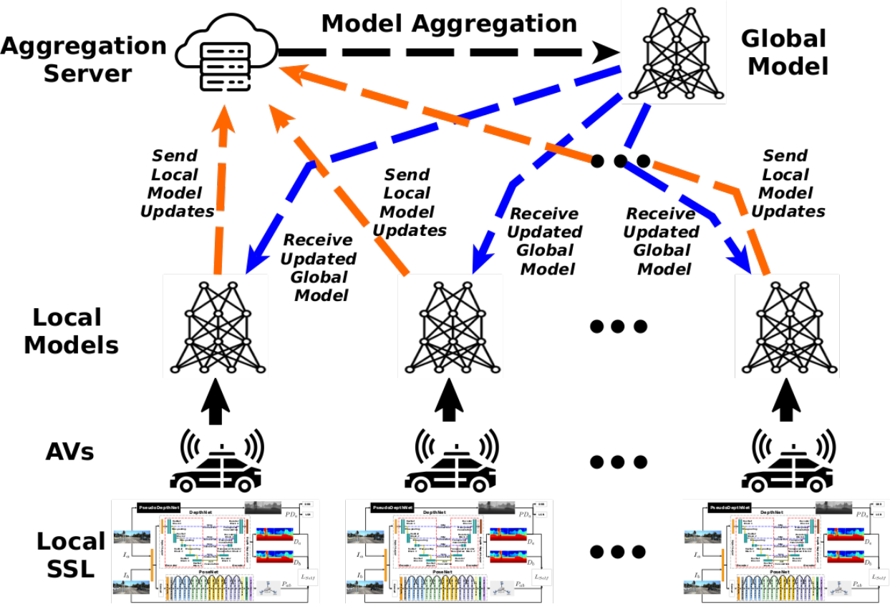
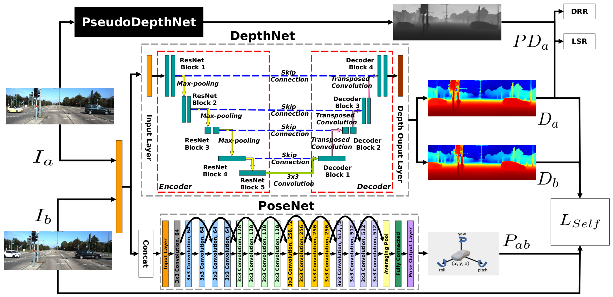

# FedSCDepth: Towards a Privacy-Preserving Collaborative Training of Monocular Depth Estimators via Self-Supervised Federated Learning

[[paper link]]()

 Author 1 and Author 2

<a href="#license">
  
</a>

## Table of Contents
- [Overview](#overview)
- [Results](#results)
  - [KITTI](#kitti) 
- [Data Preparation](#data-preparation)
- [Evaluation](#evaluation)
- [Training](#training)
  - [Dependency Installation](#dependency-installation)
  - [Start Training](#start-training)
  - [Tensorboard Visualization](#tensorboard-visualization)
- [Citation](#citation)

## Overview




### KITTI
You can download the trained models using the links below.  

|     --model     | Input size |  Abs Rel  |   Sq Rel  |    RMSE   |  RMSE log | delta < 1.25 | delta < 1.25^2 | delta < 1.25^3 
|:---------------:|:----------:|:---------:|:---------:|:---------:|:---------:|:------------:|:--------------:|:--------------:|
|  [**FedSCDepth**](https://www.dropbox.com/scl/fi/unu7v1sokwpm8txf5af2k/fedscdepth.zip?rlkey=5d6d8vh8cz0ikpo0qqoc5hyzl&dl=0)  |   832×256  | 0.128  | 0.803  | 5.015  | 0.197 |  0.836  |    0.956    |    0.984   |

## Data Preparation
Please refer to [SCDepth](https://github.com/JiawangBian/sc_depth_pl) series repository  to prepare your KITTI data. 

## Evaluation
Modify [test.sh](./test.sh) according to your local environment and run it.


## Training
#### dependency installation 
```
conda create -n federated_sc_depth_env python=3.8
conda activate federated_sc_depth_env
conda install pytorch==1.12.1 torchvision==0.13.1 torchaudio==0.12.1 -c pytorch
pip install -r requirements.txt	
```
    
#### start training
Modify [run.sh](./run.sh) according to your local environment and run it.
Alternatively you can use [run_forever.sh](./run_forever.sh) to automatically restart the training if the GPU eventually runs into memory issues (this ocurred several times during training). In this case you should set the **RESTORE_DIR** of [run.sh](./run.sh) immediatly after it starts training pointing to the directory it generated under the **OUTPUT_DIR** for it to always pick up the federated training right where it stopped in case of restarts.
    
#### tensorboard visualization
Run ```tensorboard --log_dir <OUTPUT_PATH>``` where **OUTPUT_PATH** should be the same one informed in the modified [run.sh](run.sh).

## Citation

    @InProceedings{fedscdepth,
    author    = {Author 1 and Author 2},
    title     = {FedSCDepth: Towards a Privacy-Preserving Collaborative Training of Monocular Depth Estimators via Self-Supervised Federated Learning},
    booktitle = {Proceedings of the IEEE/CVF Conference on Computer Vision and Pattern Recognition (CVPR)},
    month     = {},
    year      = {2024},
    pages     = {}
    }

